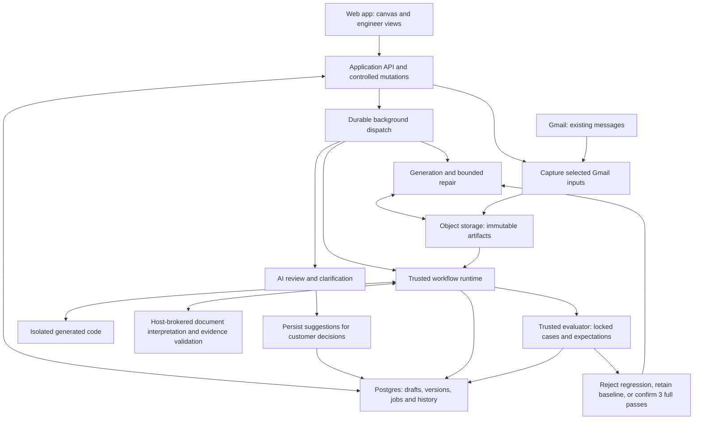
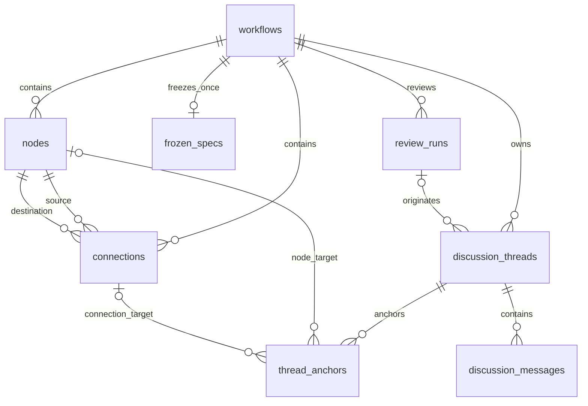
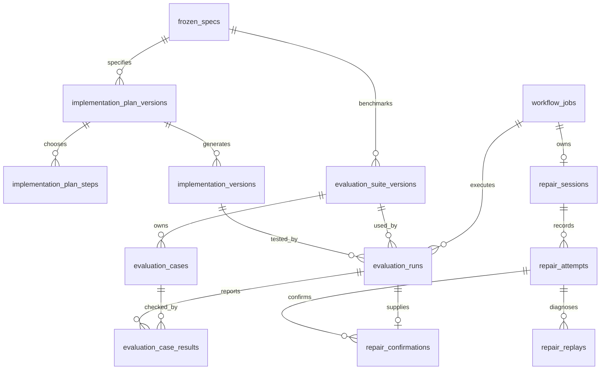
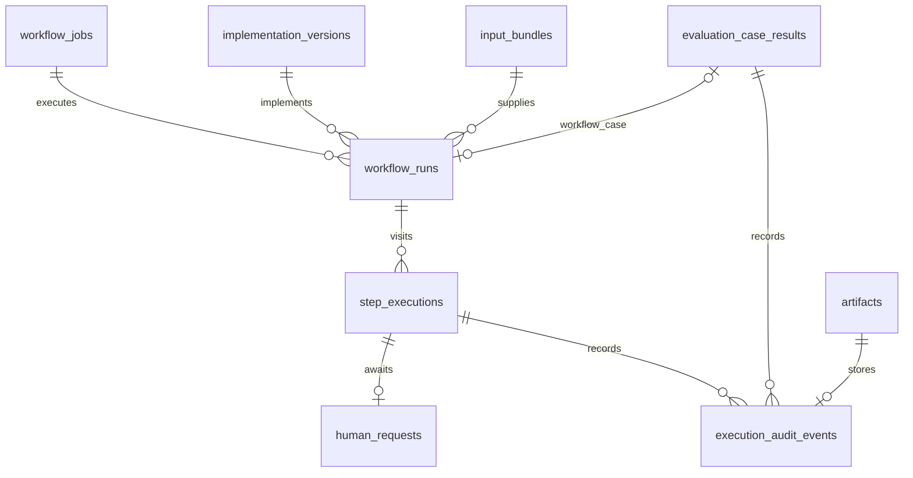

# Architecture

Architecture and design contracts · October 8, 2026. Canvas authoring, review/freeze, implementation plans/generation, runtime, evaluations, bounded repair and Gmail ingestion are implemented. A real packet completes end to end. Shipment v17 passed three consecutive fresh evaluations of the locked 24-case suite; this is a measured demo threshold, not an unseen-document accuracy guarantee. See [implementation status](../implementation-status.md) for measured outcomes and [migrations](../../app/migrations) for executable schema.

Start with the revised [Whiteboard PRD](../product/whiteboard.md) and [Self-Healing Agent PRD](../product/self-healing-agent.md). Current table rationale is in the [data-model audit](data-model.md); exact fields and constraints are defined by [migrations](../../app/migrations). [Archived interview proposals](../archive/interviews/README.md) preserve earlier alternatives and are not the executable schema.

## System boundaries

Use relational rows for independently changing records, immutable versions/manifests for reproducible handoff and execution, object storage for large files, and a durable executor for background work. The customer owns the process; AI review can suggest simplifications but cannot rewrite its graph. Engineers approve implementation methods. A trusted runtime enforces transitions, human gates, and limits; a trusted evaluator controls acceptance.

The return to generation is conditional on an explicitly started repair session and its remaining budget. It is not an endless loop. Manual runs need no grading; unit tests need no full workflow run. Reports are previews only. Generated code cannot bypass human gates, rewrite fixtures, or publish its own acceptance result.

The web/API can deploy to Vercel. Temporal Cloud owns orchestration; its worker runs as a separate persistent Node process. Vercel Sandbox is selected for generated execution. Supabase Postgres stores application state and immutable evidence; direct server connections verify TLS with the project CA. OpenAI performs review and generation, and Composio supplies read-only Gmail retrieval. Database transactions never span model calls or generated execution. The app README documents the implemented module boundaries.

Decision-relevant document extraction can use a generated JSON schema and field evidence contract. The host validates source ownership/page bounds and field dispositions; it does not decide pharmaceutical matching rules. OpenAI remains the default. The optional LlamaCloud adapter and bounded three-page reinspection are exercised only by generated `extract` requests; older `reason` requests retain their original path. Provider fixture tests do not establish a live accuracy improvement.

PostgreSQL connections are bounded per process. Server-side statement and idle-transaction deadlines release abandoned locks; the database adapter discards failed connections rather than returning them to the pool. This protects subsequent operations after a dropped connection, but does not turn an interrupted evaluation into a successful one. Its recorded error remains visible and a new evaluation establishes fresh evidence.

## Version and ownership boundaries

| Record | Mutation rule |
| --- | --- |
| Draft workflow | Editable with per-record revisions; semantic content revision excludes position-only changes. |
| Review input | Captured content and revision; goal clarification records the subsequent analyzed input explicitly. |
| Frozen spec | Immutable graph and review evidence; exactly one per workflow in the demo. |
| Implementation plan | Editable draft, immutable after approval; method changes create a new version. |
| Generated code | Immutable artifact tied to its plan and parent version. |
| Evaluation suite | Editable draft, immutable after verification/lock; corrections create a new version. |
| Evaluation | Exact code/suite pairing; terminal results remain historical evidence. |
| Repair session | Fixed plan and suite; baseline advances only on qualifying full-suite evidence. |
| Workflow run | Fixed code and captured input bundle; append visit/response history as it executes. |

Use same-workflow composite foreign keys on owned relationships and same-run keys on runtime relationships. A valid UUID alone is not evidence that a record belongs to the correct workflow, version, or execution. Foreign keys enforce membership where expressible; controlled mutations enforce lifecycle and frozen-graph rules.

## Data relationships

These diagrams show selected relationships, not every column or foreign key. Full definitions and nullability are in `app/migrations`; the schema specs retain planning context. Temporal is the selected scheduling authority. Runtime split/join state lives in Temporal. Step records expose stable branch references for inspection; no separate parallel-group/branch tables are implemented. Omit custom database worker leases; derive progress from Temporal-owned transitions. The [decision audit](data-model.md) explains this boundary and the alternatives.

Artifacts are immutable file metadata referenced by code versions and captured input manifests; large diagnostic files can use the same registry. Manifests validate artifact existence, readiness, and ownership before sealing; JSON references do not have automatic foreign-key protection. `node_id` is a definition identity; `step_execution_id` is one visit. Each Temporal join belongs to one split visit so arrivals cannot leak across loop iterations. Step branch references include the split scheduling key and entry connection.

## Operations that must be atomic

| Operation | Required invariant |
| --- | --- |
| Edit a block/route | Check workflow state and expected record revision; increment semantic revision only for content changes. |
| Start/cancel/publish review | Bind active review identity and input revision; cancelled or stale workers cannot publish or release a newer lock. |
| Apply and resolve | Approved detail patch and finding closure succeed together; stale node/thread rejects both. |
| Freeze | Validate structure, completed review, finding closure, and any warning acknowledgment; insert snapshot and lock board together. |
| Start background operation | Enforce request idempotency and workflow exclusivity; arrange recoverable dispatch after commit. |
| Human response | Accept one eligible response and schedule one continuation for that visit. |
| Parallel arrival | Record a branch's result once; schedule one merge only after all required arrivals from the same split occurrence. |
| Repair decision | Store attempt decision and change baseline together, using full-suite evidence and a current worker token. |

Unique request/scheduling keys prevent duplicate logical actions. Worker fencing prevents an old worker from publishing after a replacement or cancellation. Runtime activities heartbeat every five seconds with a 60-second liveness allowance and bounded SDK throttling; their processing and retry deadlines remain separate. The transport may deliver work more than once; the design must not assume exactly-once delivery. Queued jobs/reviews and undelivered human responses serve as durable dispatch intents. The outbox loop retries Temporal starts/signals using stable identities; no additional queue table is needed.

## Efficiency and scope

The executable schema has 26 application tables: four canvas, four review, twelve engineering/evaluation/repair, and six runtime/artifact records. Temporal owns parallel coordination, so the two proposed coordination tables are omitted. One nodes table covers every primitive type; one discussion model covers notes and findings; one jobs mechanism admits expensive operations. These tables share the existing application and worker.

One row per node does not by itself cause a scaling problem. Load a board with workflow-filtered queries; update a single node by key; query incoming/outgoing connections with endpoint indexes. An in-memory map helps rendering and traversal after loading the graph but does not replace persistent constraints or concurrency control. Do not store duplicate adjacency lists on nodes when connections already define the graph.

For an explicit sizing example—not a traffic forecast—10,000 workflows with 100 nodes each produce one million node rows. Execution history can grow much faster: 1,000 workflows × 20 runs/day × 100 visits/run produces two million visit rows/day. Measure query plans and write rates, paginate history, keep large bytes in storage, and define retention before promising production scale. Start with appropriate keys/indexes; partitioning and sharding require observed workload evidence. No production tenancy or isolation claim follows from the demo's deferred permissions scope.

Mutable nodes benefit from independent updates; frozen graphs and sealed input manifests are consumed as whole immutable aggregates. This explains the deliberate mix of rows and JSON. Avoid per-keystroke or per-pointer-move writes; debounce edits, save final positions, and retain explicit save failures. Debounce timing remains an implementation default.

## Implemented defaults and remaining work

The implemented path covers canvas/review/freeze, approved plans and source generation, runtime execution, locked evaluations, bounded repair, Gmail capture, and manual report previews. One active expensive operation includes manual runs waiting for a human. Freeze requires a desired outcome, a completed review, resolved findings and structural validity. Runs record fixed limits of 100 scheduled attempts and 900 active seconds, excluding human wait time.

Evaluation starts explicitly in the current UI; automatic first evaluation remains deferred. Hosted artifact storage and app access protection need deployment configuration. Typed runtime contracts live in `app/src/domain`; captured reference cases remain private local/runtime data. See [implementation status](../implementation-status.md) for actual live outcomes and [verification](../verification.md) for required checks. Local Mermaid diagrams reflect the implementation; the shared Excalidraw drawing has not been edited.
